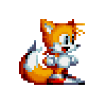

     
      
    
  # Oi, Eu sou Valéria Diniz! :D
  
  
   
  
   
  
  ### Sobre mim
  Sou analista e desenvolvedora de sistemas formada pela FATEC Ourinhos-SP, Pós-Graduada em Automação de Processos Industriais e Robótica.
  
  Eu sou programadora iniciante e entusiasta de tecnologia, atualmente cursando Gestão de Tecnologia na FATEC de Assis-SP. 
  
  Sou Brasileira, tenho 24 anos de idade. 
  
  - [certificados obtidos](https://drive.google.com/drive/folders/1aaLcMPEGfS-cl6MgauJlntreBsLSG1Nx) 
  - [credencial](https://www.credly.com/users/valeria-diniz/badges) 
  
  - 📫 Como me encontrar -> valeriasdiniz98@outlook.com
  
     
    
<a href="./README.pt-br.md">Em inglês ➤</a>

  
     
  
  

 
 

<!--
**valeriadiniz/valeriadiniz** is a ✨ _special_ ✨ repository because its `README.md` (this file) appears on your GitHub profile.

Here are some ideas to get you started:

- 🔭 I’m currently working on ...
- 🌱 I’m currently learning ...
- 👯 I’m looking to collaborate on ...
- 🤔 I’m looking for help with ...
- 💬 Ask me about ...
- 📫 How to reach me: ...
- 😄 Pronouns: ...
- ⚡ Fun fact: ...
-->
